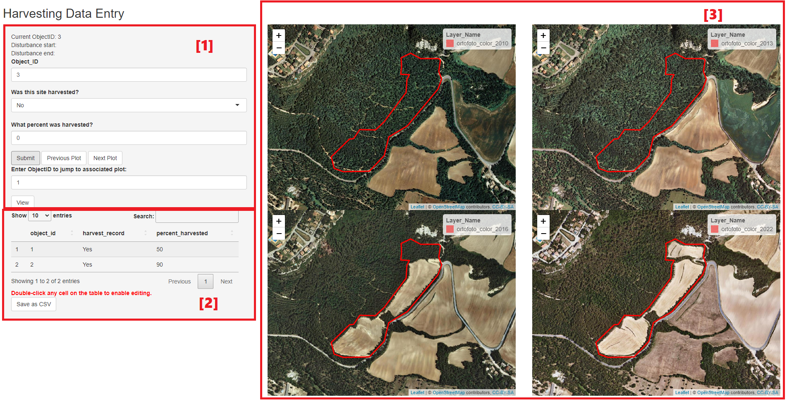
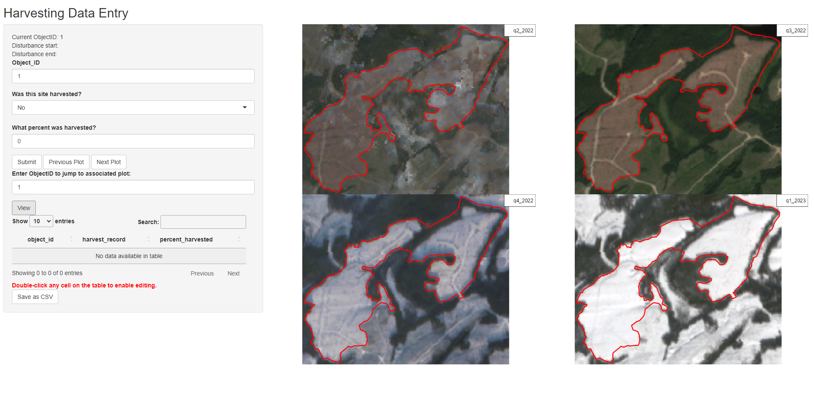

```{r setup, include=FALSE}
knitr::opts_chunk$set(echo = TRUE)
```

## Purpose

This Graphic User Interface (GUI) aims to streamline the process of conducting manual change detection through combining the ability to view up to 4 different mosaics (in either WMS/WMTS or Geotiff format) over a time-series while recording harvesting activity on the same user-friendly platform. 

## Tools
* R and RStudio
* Packages
  + shiny (1.7.4)
  + shinyFiles (0.9.3)
  + DT (0.27)
  + data.table (1.14.6)
  + leaflet (2.1.2)
  + tidyverse (2.0.0)
  + sf (1.0.12)
  + raster (3.6.20)
  + terra (1.7.23)

## The Interface Setup

The user interface is made up of three basic components, as shown below.



### <span style = "color:red">**[1] - Data Entry**</span>

This panel is where the user will enter data. At the top, the object ID of the current harvest block polygon being plotted is displayed.

#### **Functions**

* **Submit**
  + To record harvest activity, the user will fill out each field accordingly and hit the **Submit** button once they are completed. Ensure that the **Object_ID** field match the "Current ObjectID" displayed at the top.
  + When the **Submit** button is clicked, the mosaic display panel at [3] will cycle to display the next harvest block. The entry field for **Site Harvested** will be reset to *No* and the entry field for **Percent Harvested** will be reset to 0. **Object_ID** will be updated to reflect the new current Object ID.

* **Navigation**
  + To toggle between different plots, simply use the **Previous Plot** and **Next Plot** buttons.
  + To view a specific plot, enter its corresponding Object ID in the prompted field below and click the **View** button.
  
  
### <span style = "color:red">**[2] - Data Table**</span>

This panel is where the user can view, directly edit and save the data entry table as a .CSV file.

* **Editing**
  + Double-click any cell on the table to enable direct editing in that field.
  + Alternatively, the user can also update an existing field by re-entering data, upon which the field with the matching Object ID will be updated to reflect the new entry.

* **Saving**
  + To save the data table as a .CSV file, click the **Save as CSV** button. The user can then select the directory the file will be saved to.

### <span style = "color:red">**[3] - Map Display**</span>

This panel is where the harvest block polygons will be displayed on top of each WMS/WMTS or Geotiff mosaic. The user will be prompted to select the shapefile containing the polygons in the file directory, the type of mosaic displayed and information related to the mosaic upon launching the app. 

* **Viewing the Mosaic - WMS/WMTS**
  + When visualizing the WMS/WMTS mosaic, the Leaflet map is set up with dynamic zoom in accordance with the area of each shapefile in hectares (area_ha).
    - area_ha > 170 : zoom = 13
    - area_ha = 170-35 : zoom = 14
    - area_ha = 10-35 : zoom = 15
    - area_ha < 10 : zoom = 16

* **Viewing the Mosaic - Geotiff**
  + When visualizing the Geotiff mosaic, the plotted map is set up with dynamic zoom in proportion to the Geotiff file and to the area of each shapefile in hectares (area_ha).
  + The border is set using an equation where the width of the Geotiff is divided by the width/length of the shapefile (whichever is larger), then divided by a number set according to area_ha. This equation is tailored to work with GeoTIFFs roughly 1,000,000 m in width.
    - area_ha > 40 : divide by 2
    - 40 > area_ha > 17: divide by 5
    - 17 > area_ha > 10: divide by 7
    - 10 > area_ha > 6: divide by 8
    - 6 > area_ha > 3: divide by 11
    - area_ha < 3: divide by 18
    
* **Layer Name**
  + The layer name of each mosaic is displayed on the top right of each map. The user will be prompted to enter this information upon launching the app.
  
## Preparing Data

This GUI is run using a vector shapefile and the matching mosaic (in either WMS/WMTS or Geotiff format).

* **Vector Data**
  + The Harvest polygons must be stored in the form of a .SHP shapefile. 
  + The attribute table should have:
    - **area_ha** - The area of each polygon in the unit of hectares.
    - **Obj_ID** - A chronological set of numbers starting at 1, with a unique number corresponding to each polygon. 
    - **optional:** **t1** and **t2**, representing disturbance start and end dates respectively.

  **WITH**

* **WMS/WMTS Server**
  + To load the WMS/WMTS server as a Leaflet map, ensure that you have the following information:
    - A valid link to the server
    - The name of the layer you want to load

  **OR**

* **Geotiff**
  + To plot the Geotiff file, ensure that you have the following information:
    - The file path to the Geotiff file (the path separator should be a single slash, either forward or back)
    - A layer name
    
## Running the app

Start by installing the required packages in RStudio, then open and run the mosaic-viewer-app.R file. Upon launching the app, you will be prompted to select the shapefile you want to load in the local file directory. After selecting a file, wait for the message <span style = "color:red">"Click the Submit button to proceed."</span> to render before proceeding.

You should then be prompted to choose the type of mosaic file you would like to display (WMS/WMTS server or Geotiff), the number of maps you would like to display, then enter the relevant information required to plot the mosaic. Once that's completed, the app should be ready to use. Full screen the interface to view the full data table.

## App Demo

Download the zipped folder **example_data** to try out the app, including both demo data for displaying WMS and Geotiff mosaics.

-------------------------------------------------------------------------------

#### <ins>**WMS mosaic** - Demo data found in **example_data_wms** folder</ins>

Display WMS mosaics using a set of 10 shapefile polygons mapping land-use change across a twelve year time span in Catalonia. The high-quality WMS orthophotos are provided by the Institut Cartogràfic i Geològic de Catalunya ([found here](https://www.icgc.cat/en/Public-Administration-and-Enterprises/Services/Online-services-Geoservices/WMS-and-tiles-Reference-cartography/WMS-Orthophotos)).

Select the shapefile **landuse_change.shp** as your input, then select 4 as the number of mosaics to display and enter the WMS server information as shown below. This information can also be found in the **wms_map_info** text file found in the example_data folder.

* **WMS link** (same link for every mosaic): https://geoserveis.icgc.cat/servei/catalunya/orto-territorial/wms

* **Layer names**: 
  + ortofoto_color_2010
  + ortofoto_color_2013
  + ortofoto_color_2016
  + ortofoto_color_2022

The resulting interface should look similar to the screenshot shown above.

-------------------------------------------------------------------------------

#### <ins>**Geotiff mosaic** - Demo data found in **example_data_geotiff** folder</ins>

Display Geotiff mosaics using 25 shapefile polygons mapping harvest across a year long time span in central British Columbia. The Geotiffs provided are from the European Space Agency, via the Sentinel-2 MultiSpectral Instrument (MSI) Surface Reflectence. 

Open the example_data_geotiff -> shapefile folder, select the shapefile **harvest_activity.shp** as your input, then select 4 as the number of mosaics to display and enter the Geotiff information as shown below.

* **Geotiff file path**:
Find the file directory of where the example_data folder was downloaded to, then open the example_data_geotiff -> BC_clipped_mosaic folder, where the Geotiff mosaics are stored. Copy the file path of each Geotiff and enter them accordingly (be sure to not include quotation marks around the path).

* **Layer names**: Enter the layer name of each Geotiff as their file name in the folder. 

The resulting interface should look similar to the screenshot shown below.


